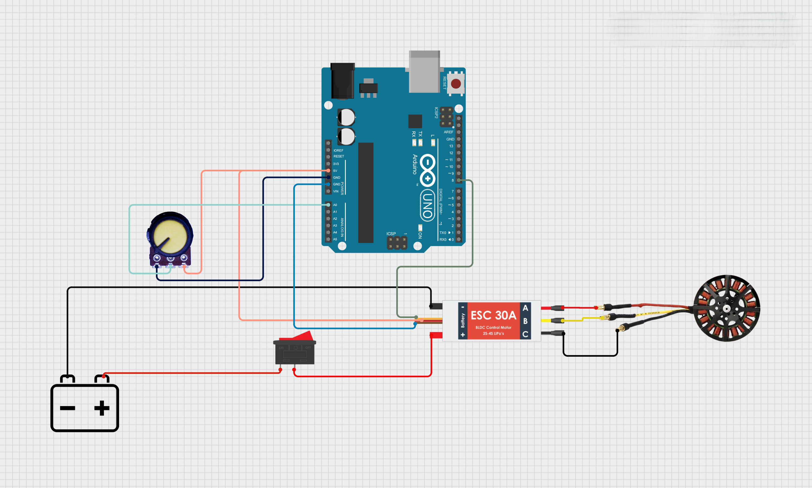

# ⚙️ Speed and Directional Control of a BLDC Motor Using Pulse Width Modulation (PWM)

### 🎯 Project Overview  
This project demonstrates how to control both the **speed** and **direction** of a **Brushless DC (BLDC) motor** using an **Electronic Speed Controller (ESC)** and an **Arduino microcontroller**.  
The motor’s speed is controlled via a **potentiometer** (using PWM signals), while its **rotation direction** (clockwise or anticlockwise) can be switched through the **code logic** — no hardware rewiring required.

---

## 📁 Repository Structure

| File Name | Description |
|------------|--------------|
| `installed.ino` | The **mother code** that initializes the ESC and handles speed control via potentiometer. |
| `clockwise.ino` | Code to rotate the BLDC motor in the **clockwise direction**. |
| `anticlockwise.ino` | Code to rotate the BLDC motor in the **anticlockwise direction**. |
| `Circuit_Diagram.png` | The **wiring layout** of the full circuit including Arduino, ESC, BLDC motor, potentiometer, and power source. |

---

## 🧩 Components Required

| Component | Quantity | Description |
|------------|-----------|-------------|
| Arduino Uno / NodeMCU | 1 | Microcontroller to generate PWM signals |
| BLDC Motor | 1 | Brushless DC motor (3-phase) |
| ESC (Electronic Speed Controller) | 1 | 30A ESC used to drive the BLDC |
| Potentiometer (10kΩ) | 1 | To vary motor speed |
| Li-Po Battery / 12V DC Supply | 1 | Power source for ESC |
| Switch (optional) | 1 | To control power |
| Jumper Wires | — | For connections |

---

## 🔌 Circuit Connections

Refer to **`Circuit_Diagram.png`** for detailed wiring.  
Below is a summary of the key connections:

| Connection | Arduino Pin | ESC / Component |
|-------------|--------------|----------------|
| ESC Signal | D8 | ESC Input Signal |
| ESC GND | GND | ESC Ground |
| Potentiometer Middle Pin | A0 | Analog input to Arduino |
| Potentiometer Side Pins | +5V & GND | Power and ground |
| ESC Power Input | Battery + / - | Power supply for motor |
| ESC Output (A, B, C) | — | Connect to BLDC motor terminals |

> 🟡 **Note:** Swapping any two ESC–motor wires reverses the motor’s direction.  
> However, in this project, **the direction is reversed purely through code logic**, keeping hardware wiring constant.

---

## ⚙️ Code Workflow

### 1. `installed.ino` – Mother Code  
- Initializes and calibrates ESC.  
- Reads potentiometer input (0–1023).  
- Converts analog input to PWM (1000–2000 µs).  
- Controls motor speed in **default direction**.

### 2. `clockwise.ino` – Clockwise Rotation  
- Drives the motor in the **clockwise direction**.  
- Uses potentiometer for speed variation.  
- Fully software-controlled.

### 3. `anticlockwise.ino` – Anticlockwise Rotation  
- Reverses the ESC signal logic for **anticlockwise rotation**.  
- Maintains the same potentiometer-based speed control.  
- No physical rewiring required.

---

## 🧠 How It Works

1. **ESC Calibration:**  
   When powered on, the ESC reads the PWM signal from Arduino to set the throttle range.

2. **Speed Control:**  
   The potentiometer changes the PWM signal width from **1000 µs (min)** to **2000 µs (max)**, adjusting motor speed.

3. **Direction Control:**  
   Using different `.ino` codes (CW or CCW), the PWM signal is inverted or reconfigured to rotate the BLDC motor in the desired direction.

---

## 🚀 Steps to Run the Project

1. Connect components as shown in the circuit diagram.  
2. Upload `installed.ino` to **initialize and calibrate** your ESC.  
3. After calibration:
   - Upload `clockwise.ino` for clockwise rotation, or  
   - Upload `anticlockwise.ino` for anticlockwise rotation.  
4. Use the potentiometer to control motor speed.  
5. Observe smooth and safe directional control of your BLDC motor.

---

## 🖼️ Circuit Diagram

> 📘 **Tip:** Ensure all grounds (Arduino, ESC, and power supply) are connected together for proper signal reference.

---

## ⚡ Color Legend (Wire Reference)

| Color | Function |
|--------|-----------|
| 🔴 Red | Power (+) |
| ⚫ Black | Ground (-) |
| 🟢 Green | ESC Signal |
| 🔵 Blue | Potentiometer line |

---

## 🧾 License

This project, **Speed and Directional Control of a BLDC Motor Using PWM**, is open-source and free to use for educational and research purposes.

⭐ *If you found this project helpful, don’t forget to star the repository!*
